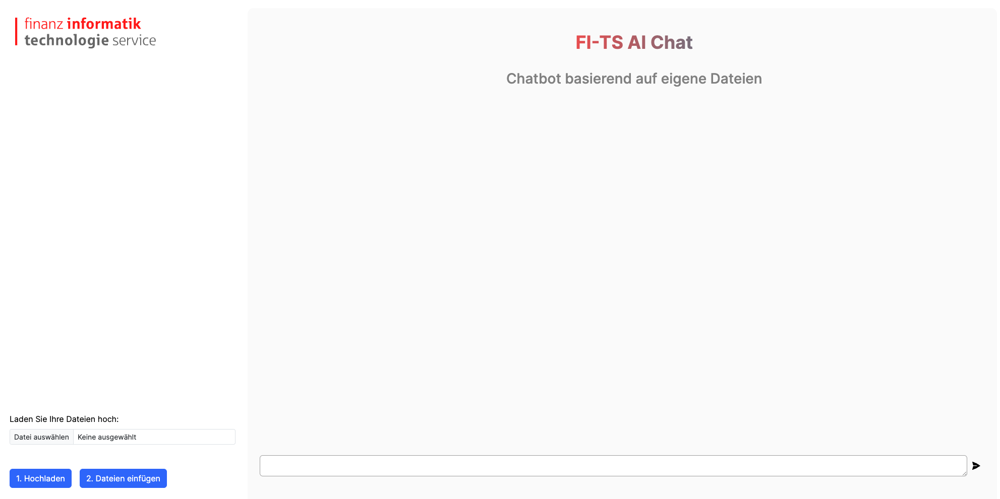

# FI-TS AI Chat

Erstellen Sie einen QnA-Chatbot für Ihre Dokumente, ohne auf das Internet angewiesen zu sein, indem Sie die Fähigkeiten lokaler LLMs nutzen. Gewährleisten Sie vollständige Privatsphäre und Sicherheit, da keine Ihrer Daten jemals Ihre lokale Ausführungsumgebung verlassen. Nahtlose Bearbeitung und Abfrage Ihrer Dokumente auch ohne Internetverbindung.



## Inhaltsverzeichnis

* [Anforderungen](#anforderungen)
* [Installation](#installation)
* [Support](#support)
* [Daten](#daten)
* [Quellen und Shout Out's](#quellen-und-shout-outs)

## Anforderungen

* Python 3.8 or later
* NodeJS v18.12.1 or later
* Minimum 16GB of memory

## Installation

1. Gehen Sie in den Client-Ordner und führen Sie die folgenden Befehle aus:

   ```shell
   npm install   
   ```

   ```shell
   npm run dev
   ```

2. Gehen Sie in den Server-Ordner und führen Sie die folgenden Befehle aus:

   ```shell
   pip install -r requirements.txt
   ```

   ```shell
   python privateGPT.py
   ```

3. Öffnen Sie <http://localhost:3000>, klicken Sie auf Modell herunterladen, um das gewünschte Modell zunächst herunterzuladen

4. Laden Sie ein beliebiges Dokument Ihrer Wahl hoch und klicken Sie auf Ingest data. Die Aufnahme erfolgt schnell.

5. Führen Sie nun eine beliebige Abfrage über Ihre Daten durch. Die Datenabfrage ist langsam, daher sollten Sie einige Zeit warten.

## Support

Wir sind dabei, für Feedback eine Intranet Seite mit einem Formular und ein Gruppenpostfach zu erstellen.

## Daten

Dateien die eingebettet werden können:

* .csv: CSV,
* .docx: Word Document,
* .enex: EverNote,
* .eml: Email,
* .epub: EPub,
* .html: HTML File,
* .md: Markdown,
* .msg: Outlook Message,
* .odt: Open Document Text,
* .pdf: Portable Document Format (PDF),
* .pptx : PowerPoint Document,
* .txt: Text file (UTF-8),

## Quellen und Shout Outs

* [Initial Repo](https://github.com/imartinez/privateGPT)
* [Updated Repo with UI](https://github.com/SamurAIGPT/privateGPT)

